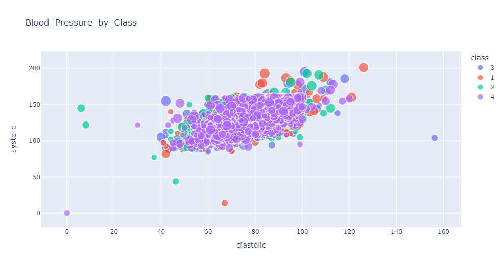

# MACHINE LEARNING PROJECT

  

## Health App - Machine Learning   

### Scope
    Build a Health app to perform health predictions for various scenarios by 
    utilising machine learning algorithms, python libraries and
    host on a cloud platform with public access.

### About us: 
    DAJK Team: “Does AI Just Know”? 
    Daniela Cornea (DC)
    Anh Huong (AH)
    Josh Lowe (JL)
    Kelvin Nguyen (KN)

 

### Software
    Python, Pandas, Seaborn, Matplotlib, Plotly Express, TQDM, Sklearn,  
    XGBoost, nltk,  Pickle, Flask API, HTML/CSS/Bootstrap, other.

### Datasets
#### Selected datasets:
>[Heart Disease](data\heart_2020_cleaned.csv)  
>[Stress Lysis](data\Stress-Lysis.csv) 
>[Body Performance](data\bodyPerformance.csv) 
>[Travel Insurance Predictions](data\TravelInsurancePrediction.csv) 
 

#### Other testing datasets:
>[Personality Classification](data\psyc.csv) 
>[Absenteeism at work.csv](data\Absenteeism_at_work2.csv) 

#### Data Sources
    Kaggle
    Dataworld

### Machine Learning Models Overview

### Model creation
For exploratory data analysis, train, test, validate and generating models we use Jupiter Notebooks 
>[Stroke Prediction Model](notebooks\stroke_prediction3.ipynb) 
>[Physical Stress Model](notebooks\stress_predicton_final.ipynb) 
>[Body Performance Model](notebooks\body_performance.ipynb) 
>[Travel Insurance Prediction Model](notebooks\travel_insurance_prediction.ipynb)

### Heroku Deployment 
>[Heroku_HealthApp](https://health-app-ah.herokuapp.com/index.html) 
>Environment [Requirements](app\requirements.txt) for app to run on local computer

### Presentation slides
>[Link to Google doc](https://docs.google.com/presentation/d/1LHusZiVUhgSsV_HqJe-RtlS_o659OSEpfjRECQO6ge4/edit#slide=id.p8)  

### Visualisations

  

