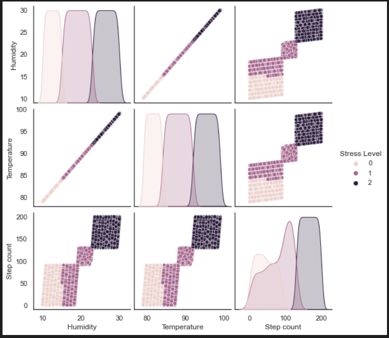
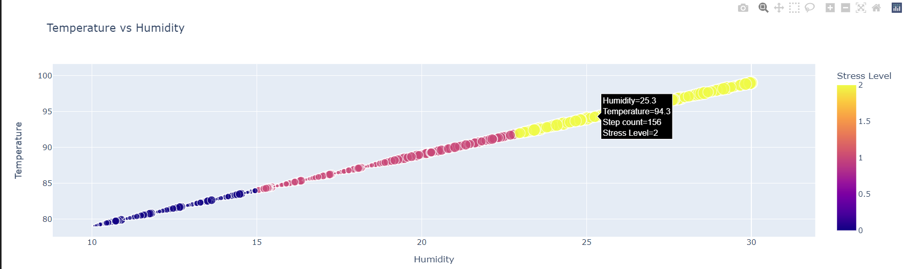
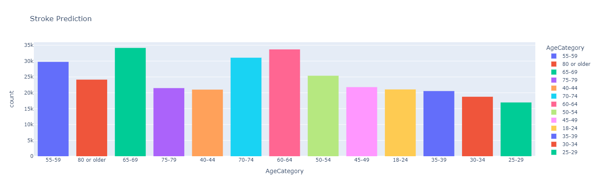

# Final-Project

  

## Health App - Machine Learning  

Scope: Build a Health app to perform health predictions for various scenarios by utilising machine learning algorithms, python libraries and host on a cloud platform with public access.

### Project repo: 
https://github.com/DCornea5/Final-Project.git

### DAJK Team: “Does AI Just Know”? 
    Daniela Cornea (DC)
    Anh Huong (AH)
    Josh Lowe (JL)
    Kelvin Nguyen (KN)

#### Software
    Python, Pandas, Seaborn, Matplotlib, Plotly Express, TQDM, Sklearn,  
    XGBoost, nltk,  Pickle, Flask API, HTML/CSS/Bootstrap, other.

#### Datasets
    heart_disease.csv  
    stress-Lysis.csv
    bodyPerformance.csv
    TravelInsurancePredictions.csv
    psyc.csv
    Absenteeism_at_work.csv 

#### Data Sources
    Kaggle
    Dataworld

#### Machine Learning Models  
    Stroke Prediction - Logistic Regression 
    Physical Stress Prediction - KNN Classification
    Travel Insurance Indicator - KNeighborsClassifier
    Body Performance Classification - Light Gradient Boosting

#### Visualisations

  
#### Heroku Deployment 
[Heroku_HealthApp](https://health-app-ah.herokuapp.com/index.html)
  

 

